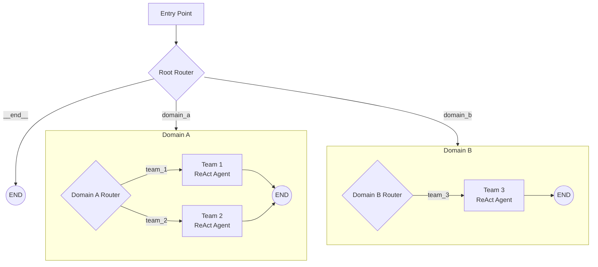
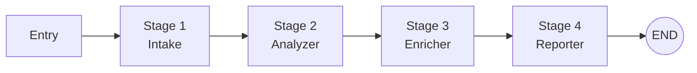
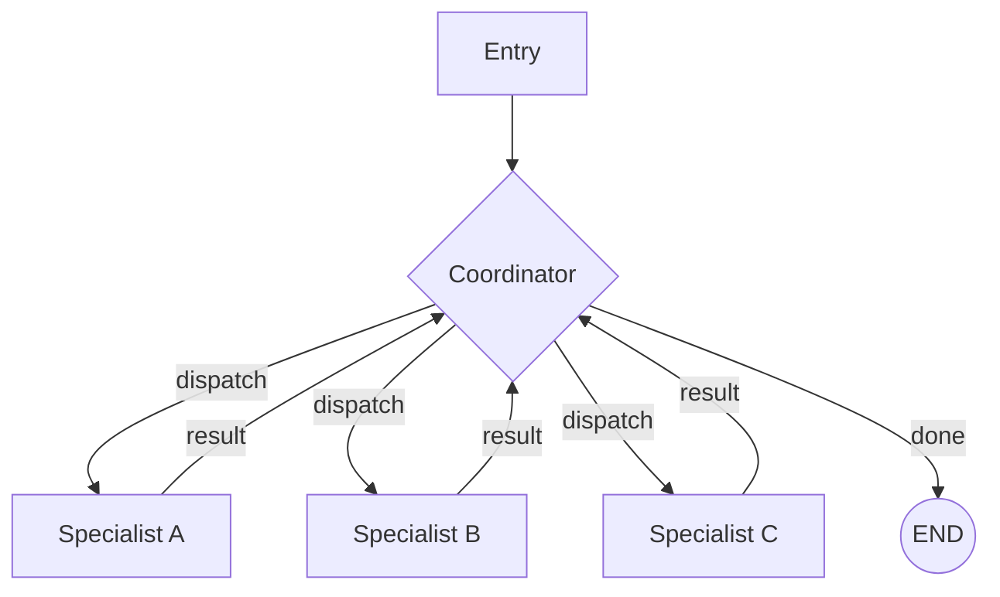
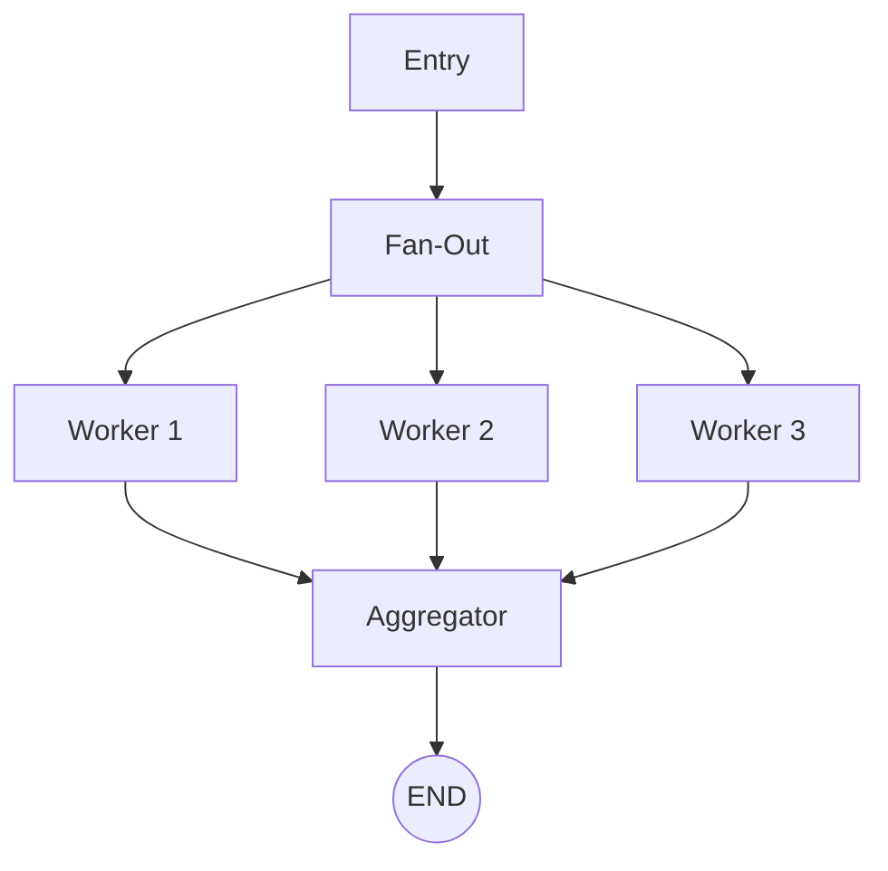

# Visualize

Generate a Mermaid flowchart diagram of the current project's agent graph topology. Reads the project's source code to identify nodes, edges, subgraphs, and their relationships.

## What This Does

Produces a Mermaid diagram showing:
- All nodes in the graph (agents, routers, tools, subgraphs)
- All edges (fixed and conditional)
- Subgraph nesting (domains, teams, squads)
- Entry points and END connections
- Node types (differentiated by shape)

## Prerequisites

- A project initialized with `/init` (any topology)
- At least one node in the graph (otherwise shows empty graph)

## Parameters

None required. Optional:

1. **Output format** -- `mermaid` (default, text output) or `figma` (uses generate_diagram tool)
2. **Detail level** -- `overview` (top-level nodes only) or `detailed` (includes subgraph internals)
3. **Scope** -- `full` (entire graph) or specific domain/team name

## Workflow

### Step 1: Analyze project structure

Read the following files to understand the topology:

1. **`graph.py`** -- Main graph definition (nodes, edges, entry point)
2. **`root_orchestrator.py`** (if exists) -- Hierarchical routing
3. **`graphs/domains/*/supervisor.py`** -- Domain supervisors
4. **`graphs/domains/*/teams/*/graph.py`** -- Team graphs
5. **`graphs/squads/*/graph.py`** or domain squads -- Cross-domain squads
6. **`.aod/state.yaml`** (if exists) -- Applied skills history

### Step 2: Build node inventory

For each file, extract:
- Node names (from `add_node()` calls)
- Node types (agent, router, tool_node, subgraph -- inferred from code patterns)
- Edge connections (from `add_edge()` and `add_conditional_edges()` calls)
- Entry points (from `set_entry_point()`)

### Step 3: Generate Mermaid diagram

Use the following node shape conventions:

```
Agents:     [Agent Name]     -- rectangle
Routers:    {Router Name}    -- diamond
Tools:      [[Tool Node]]    -- double brackets
Subgraphs:  subgraph block   -- grouped
END:        ((END))          -- circle
```

### Step 4: Output the diagram

**For `mermaid` format** (default):

Output the Mermaid code as a fenced code block:

````
```mermaid
graph TD
    ... diagram content ...
```
````

**For `figma` format**:

Use the `generate_diagram` MCP tool to create a FigJam diagram.

## Diagram Templates

### Hierarchical Topology



### Pipeline Topology



### Hub-Spoke Topology



### Map-Reduce Topology



## How to Read the Code

### Finding nodes
```python
# In graph.py or any builder file
workflow.add_node("node_name", node_function_or_subgraph)
builder.add_node("node_name", ...)
```

### Finding edges
```python
# Fixed edges
workflow.add_edge("source", "target")
workflow.add_edge("source", END)

# Conditional edges
workflow.add_conditional_edges(
    "source",
    routing_function,
    {"condition_a": "target_a", "condition_b": "target_b", "__end__": END}
)
```

### Finding entry points
```python
workflow.set_entry_point("first_node")
```

### Identifying node types
- **Agent**: Function that calls `llm.ainvoke()` or `llm.bind_tools()`
- **Router**: Function that returns a route string, used in `add_conditional_edges`
- **Tool node**: `ToolNode(tools)` from `langgraph.prebuilt`
- **Subgraph**: Compiled graph passed as node (e.g., `domain_supervisor`)

## Report

After generating the diagram, explain:

```
Current topology: {topology_type}

Nodes ({count}):
  - {node_name} ({type}) -- {brief description}
  ...

Edges ({count}):
  - {source} → {target} ({fixed|conditional})
  ...

Applied skills: {list from .aod/state.yaml if available}
```

## Example Usage

```
User: /visualize
Claude: [Reads graph.py, root_orchestrator.py, domain supervisors]

        Current topology: hierarchical

        ```mermaid
        graph TD
            Entry --> Router{"Root Router"}
            Router -->|"scheduling"| ...
            ...
        ```

        Nodes (8):
        - root_router (router) -- Routes to 2 domains
        - scheduling_supervisor (subgraph) -- Scheduling domain
        - scheduling/calendar (agent) -- Calendar management
        - scheduling/reminders (agent) -- Reminder management
        - knowledge_supervisor (subgraph) -- Knowledge domain
        - knowledge/search (agent) -- Knowledge search
        - knowledge/qa (agent) -- Q&A responder

        Applied skills: init, topology-hierarchical, create-domain x2, create-team x4
```
